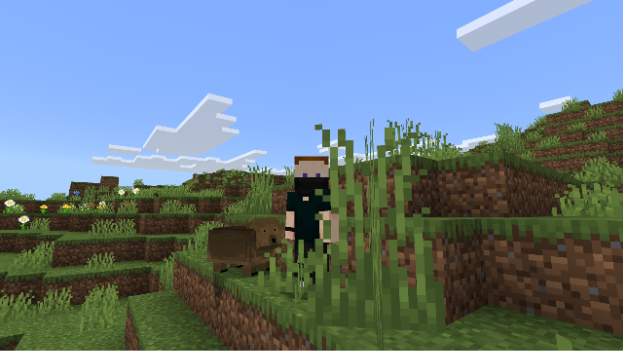

# Wombat Addon

  

Welcome to the Wombat addon! This project introduces a custom Wombat entity to your Minecraft world, complete with unique behaviors, taming mechanics, and a day/night sleep cycle. 

## 🐾 Wombat Behavior and Features

Based on the core logic found in `wombat.behavior.json`, here is what you can expect from these new creatures:

* **Spawning:** Wombats spawn naturally as creatures in the world. There is a 95% chance they will spawn as adults and a 5% chance as babies.
* **Sleep Cycle:** Wombats are diurnal! When nighttime falls, they will find a spot to sleep. If they are sleeping and a player or a zombie gets too close (within 6 blocks), or if they are attacked, they will become "disturbed" and remain on high alert for 15 seconds before calming down.
* **Diet and Breeding:** 
  * **Babies** can be fed mangrove roots, hanging roots, or ferns to speed up their growth. 
  * **Adults** can be bred using wheat (requires the wombats to be tamed and at full health).
* **Taming:** You can tame a wild wombat by feeding it **Cookies** (33% chance of success per cookie). Cookies can also be used to heal them. Once tamed, a wombat will follow you, can be ordered to sit, and will defend you from attackers.
* **Combat:** Don't let their cute appearance fool you. Wild wombats will defend themselves with a heavy **Ram Attack** that deals knockback, followed by melee attacks. They specifically target players and zombies that disturb them.

## 🎵 Important: Missing Audio Files

Please note that the custom audio files for the wombat are **not included** in this repository. The original sound files were sourced from the official Mojang GitHub repository, and they have been excluded here to strictly respect their commercial rights and copyright boundaries.

To experience the wombat with its intended sounds, you will need to source the audio yourself and add them to the correct audio directory in this pack.

You must include the following files:
* `wombat_dead`
* `wombat_hurt`
* `wombat_idle`

## ⚖️ License

This project is protected and licensed under the **PolyForm Noncommercial License 1.0.0**.

**What this means for you:**
* **Allowed:** You are completely free to download, play, modify, and use this addon for personal use, private multiplayer sessions, and hobby projects.
* **Not Allowed:** You may **not** use this addon for any commercial purposes. This includes, but is not limited to, placing it behind a paywall, including it in a monetized server, or selling it as part of a bundle.

By using this software, you agree to these terms. Please see the [`LICENSE`](LICENSE.md) file in this repository for the complete legal text and exact details.

### Asset and Image Exceptions

* **Original Assets (Logos/Branding):** My original project logo and branding assets (located in the `assets/` folder) are licensed under the **Creative Commons Attribution-NonCommercial-NoDerivatives 4.0 International (CC BY-NC-ND 4.0)**. Please see `assets/LICENSE.md` for the full license text.
* **Game Screenshots:** Any images containing in-game assets, textures, or designs are the intellectual property of Mojang Synergies AB and Microsoft Corporation. They are included here strictly as unofficial reference material and are excluded from the above licenses.
